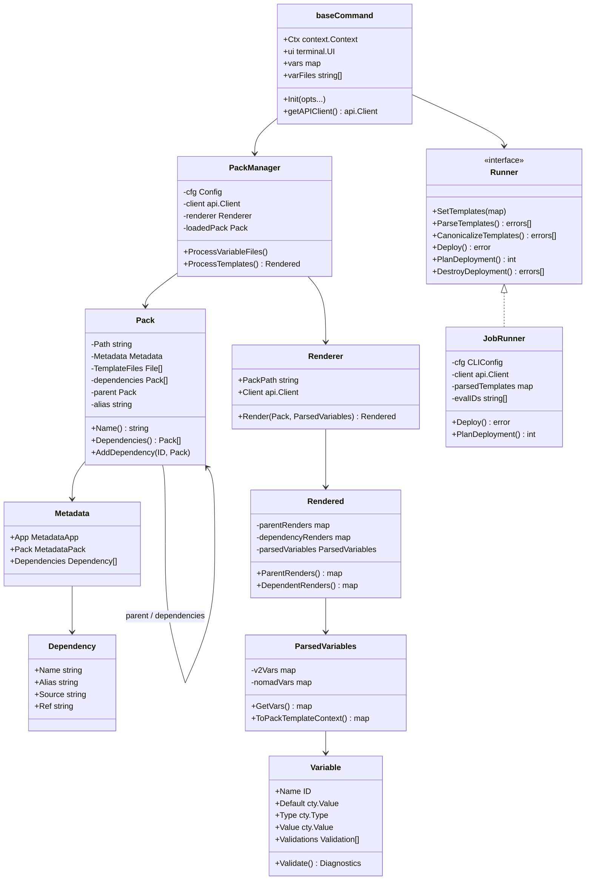
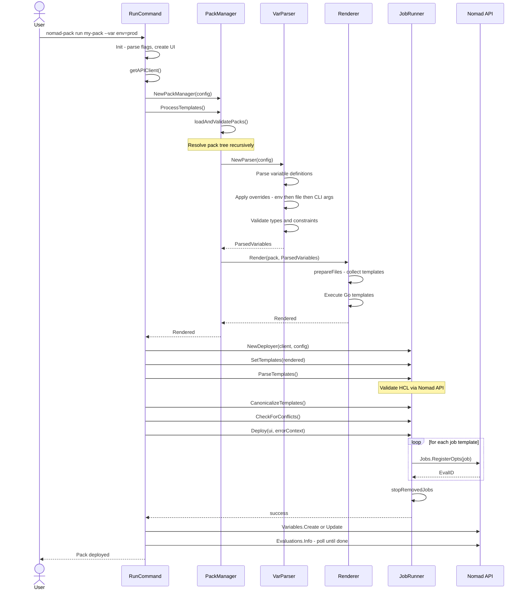

# CONTRIBUTING to Nomad Pack

## Architecture

Nomad Pack is structured around four layers: CLI commands, a pack manager, a
renderer/variable pipeline, and a runner that communicates with the Nomad API.

### Package overview

| Package | Responsibility |
|---|---|
| `internal/cli` | Command parsing, flag handling, user-facing orchestration |
| `internal/pkg/manager` | Load pack trees, coordinate variable parsing and rendering |
| `internal/pkg/renderer` | Execute Go templates against resolved variables |
| `internal/pkg/variable/parser` | Parse variable definitions, apply overrides, validate |
| `internal/pkg/variable/source` | External variable sources: Consul, Vault, and Nomad Variables |
| `internal/pkg/caching` | Local registry and pack cache backed by Git |
| `internal/runner` | `Runner` interface — deploy, plan, destroy |
| `internal/runner/job` | Concrete runner for Nomad job objects |
| `sdk/pack` | `Pack` and `Metadata` structs — the public pack model |
| `sdk/pack/variables` | `Variable` type with HCL2 type constraints and validations |
| `terminal` | `UI` interface — console, non-interactive, and live-view outputs |

### Key types



### Command interaction: `nomad-pack run`

The following sequence traces one complete `run` invocation from user input through
to a deployed Nomad job.



### Variable resolution order

Variables are resolved in the following order, with later sources winning on
conflict:

1. Default values declared in `variables.hcl`
2. External sources — Consul KV, Vault secrets, and Nomad Variables (in source order)
3. Variable files passed with `-f` / `--var-file` (left to right)
4. Individual `--var key=value` flags

## Code contributions

We welcome contributions to Nomad Pack.

To add packs, contribute to the [Nomad Pack Community Registry](https://github.com/hashicorp/nomad-pack-community-registry).

### Development dependencies

- Go (see [`.go-version`](.go-version) for the required version)
- Git
- Make

Ensure `$GOPATH/bin` is on your `$PATH`.

### Build and run locally

Install required tools:

```shell-session
$ make bootstrap
```

Check `go.mod` and `go.sum`:

```shell-session
$ make check
```

Build a binary from local code. The binary is output to `./bin/nomad-pack`:

```shell-session
$ make dev
```

Run the binary:

```shell-session
$ ./bin/nomad-pack -h
```

### Common make targets

| Target | Purpose |
|---|---|
| `make bootstrap` | Install all development tools |
| `make check` | Verify Go mod is tidy |
| `make dev` | Build binary to `./bin/nomad-pack` |
| `make test` | Run the full test suite |
| `make lint` | Lint source code with golangci-lint |

Run `make help` to see all available targets.


